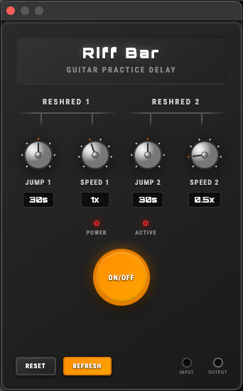
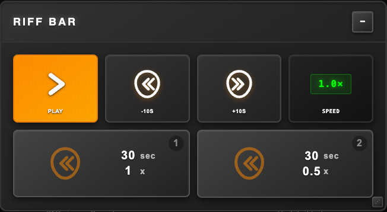
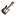
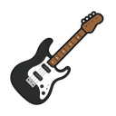

<!-- ──────────────────────────────── -->
<!--  R I F F  B A R   R E A D M E   -->
<!-- ──────────────────────────────── -->

# 🎸 Riff Bar &nbsp;|&nbsp; "Home of the Reshred Button"

> A floating guitar-pedal control bar that shreds your **YouTube practice sessions** into tight, repeatable riffs.  
> No more fumbling for the timeline—just stomp, shred, repeat. 🔥

---

## ⚡ Inspiration
Between drop-D riffs and face-melting solos, pausing a video breaks the vibe.  
Riff Bar borrows the **look & feel of a vintage stompbox**—knobs, LEDs, and a big chunky foot-switch—then hot-glues it right onto any YouTube page. Now you can loop, slow down, or jump back 30 seconds *without* lifting your hands off the axe (or your feet off a MIDI pedal).

---

## 🚀 Feature Line-Up

| 🔩  | Feature | Why It Rocks |
|----|----------|--------------|
| 🪄 | **Draggable "pedal" overlay** | Park it anywhere on the page—left, right, backstage. |
| ⏯️ | **One-tap play/pause** | No more keyboard gymnastics mid-riff. |
| 🎯 | **Reshred buttons** | Two custom control groups ("Reshred 1" & "Reshred 2") so you can shred on your guitar again. |
| ⏪ / ⏩ | **Dual jump switches** | Rewind or fast-forward in *configurable* intervals (5s to 2min). |
| 🏃‍♂️ | **Two speed knobs** | Dial in half-time breakdowns or hyperspeed 2× runs (0.25× to 2×). |
| 🎚️ | **Professional tick marks** | Visual position indicators with glowing orange highlights show exactly where your knobs are set. |
| 🔴 | **LED status lights** | Know at a glance if the pedal is active & your tone is 🔥. |
| 💾 | **Position memory** | Riff Bar remembers exactly where you left it. |
| 🎨 | **Amp-inspired popup** | Tweak settings in a slick, retro-futuristic Orbitron UI with grouped controls. |
| 🎚️ | **MIDI-ready core** | Plug in a foot-pedal (via Web MIDI) and take hands-free control *(roadmap)*. |

---

## 🖼️ Screenshots  

|   |   |
|---|---|
| **Popup Pedal Interface** | **In-Video Overlay** |
|  |  |

---

## 🔧 Installation

### Option A – Chrome Web Store *(coming soon)*
1. Click **Add to Chrome**  
2. Shred.

### Option B – Developer Mode
1. `git clone https://github.com/dcerniglia/riff-bar.git`
2. `chrome://extensions` → **Developer mode** → **Load unpacked** → select project folder.
3. Profit. 🤘

## 🧱 Extension Icons

Riff Bar ships with custom PNG icons based on the official logo. These are required by Chrome for various UI elements and are located in the `/icons/` folder.

| Size | Preview | File |
|------|---------|------|
| 16×16 |  | `icon16.png` |
| 32×32 |  | `icon32.png` |
| 48×48 |  | `icon48.png` |
| 128×128 |  | `icon128.png` |

> 💡 You can customize the icons by replacing the PNGs in the `/icons/` directory. Just keep the sizes and filenames the same.
---

## 🎛️ Reshred Button Controls

The popup features two distinct control groups designed for maximum shredding efficiency:

### Reshred 1 Group
| Control | Range | Default | Quick Tip |
|---------|--------|---------|-----------|
| **JUMP 1** Knob | 5s, 10s, 15s, 30s, 45s, 60s, 120s | 30s | Perfect for tricky licks. |
| **SPEED 1** Knob | 0.25×, 0.5×, 0.75×, 1×, 1.25×, 1.5×, 1.75×, 2× | 1× | Standard practice tempo. |

### Reshred 2 Group  
| Control | Range | Default | Quick Tip |
|---------|--------|---------|-----------|
| **JUMP 2** Knob | 5s, 10s, 15s, 30s, 45s, 60s, 120s | 30s | Skip past dead air. |
| **SPEED 2** Knob | 0.25×, 0.5×, 0.75×, 1×, 1.25×, 1.5×, 1.75×, 2× | 0.5× | Slow-mo riff surgery. |

### Master Controls
| UI Element | Function | Quick Tip |
|------------|----------|-----------|
| **ON/OFF** Switch | Enable / Bypass | True-bypass* vibe for your browser. |
| **Tick Marks** | Visual position indicators | Glowing orange dot shows current setting. |

> 🎯 **Pro Tip**: Each knob features precision tick marks around the perimeter. The current setting glows orange like a tube amp, so you always know exactly where you're dialed in.

---

## 🏗️ Under the Hood
- Manifest V3 (`background.js` service worker)
- `content.js` injected at **document_end** on any `youtube.com` domain
- Zero external libs—pure vanilla JS + CSS (Orbitron & Roboto Condensed fonts)
- State persistence via `chrome.storage.local`
- Professional UI with grouped controls and visual feedback

```
riff-bar/
├─ manifest.json        # Extension manifest
├─ background.js        # Service worker
├─ content.js           # Injected control logic
├─ styles.css           # Overlay styling
├─ popup.html           # Popup interface
├─ popup.css            # Popup styling
├─ popup.js             # Popup logic
├─ icons/               # 16, 32, 48, 128 px PNGs
└─ README.md            # This file
```

---

## 🛠️ Development Workflow
```bash
# install deps (if you add tooling)
npm i

# hack, save, and in Chrome:
chrome://extensions → 🔄 Reload
# then refresh any YouTube tab


---

## 🔮 Roadmap
- 🎚️ Full Web MIDI support for hands-free foot-controller action
- ⌨️ Custom hotkeys so keyboard heroes can jam too
- 🌙 Dark-amp theme (black tolex & glowing tubes)
- 🌐 Firefox & Edge ports

Contributions welcome—open a PR, file an issue, or just send riffs.
If it makes the extension louder, faster, or cooler, we're in. 🤟

---

## 📝 License

MIT—because good code (and good music) should be shared.

---

Riff Bar is built with ❤️, caffeine, and palm-muted power chords.
See you in the comments section—let's jam! 🤘